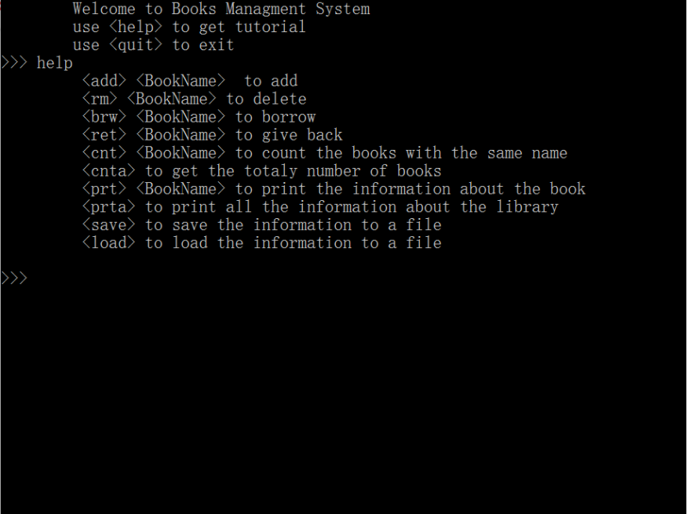

# 1.图书馆管理系统
## 简介
### 该图书管理系统是由C++语言编写而成，具有**添加、删除、借阅、归还、查询图书信息**等功能，可用于各种各样的存储图书场所，简便易用。 如想试用或者有什么建议改善，请使用以下邮箱联系作者：
Email：<hkyly0217@163.com>   or    <920908145@qq.com>

## 项目测试

### 需要进行代码测试请联系作者邮箱，所得代码可以在**visual studio community 2017**进行调试

## 使用说明

### _登陆该系统后，出现如图所示样式，使用方法如下_
* **添加** 图书功能，输入 <label style="color:red">‘add’  </label>可将图书的名称、书号、作者、借书者、借书日期、还书日期等信息录入系统中
* **删除** 图书功能，输入 <label style="color:red">'rm'  </label>后输入想删除的图书书号，确认删除后可将该图书所有信息从系统中删除
* **借阅** 图书功能，输入 <label style="color:red">‘brw’  </label>后输入要借阅的图书书号，确认后借阅该图书
* **归还** 图书功能，输入 <label style="color:red">‘ret’  </label>后输入要归还的图书书号，确认后归还图书
* **计数** 图书功能，输入 <label style="color:red">'cnt'  </label>后输入要查询的图书书号，确认后显示图书数量
* **存储** 图书功能，输入 <label style="color:red">'save'  </label>将会将所有当前关于图书存储信息保存至一个文件夹
* **下载** 图书功能，输入 <label style="color:red">'load'  </label>若信息丢失，可将最近保存的图书信息从存储文件夹处下载复原

## 注意事项
1. 该系统需要在visual C++ 6.0版本及以上环境下运行

2. 图书信息不能为空

3. 此版本用于学术交流，严禁私自用作商业方面

## 项目的贡献者
 
 __*华中科技大学小钟同学*__<13507299039@163.com>
 __*华中科技大学小杨同学*__<hkyly0217@163.com>
## 协议
版权所有 (C) Microsoft Corporation。保留所有权利
 根据[MIT License](./LICENSE)获得许可。

## 致谢
**完成此次图书管理系统以及说明，由衷感谢华中科技大学的指导老师，以及北京盛安德公司指导员的大力帮助**
